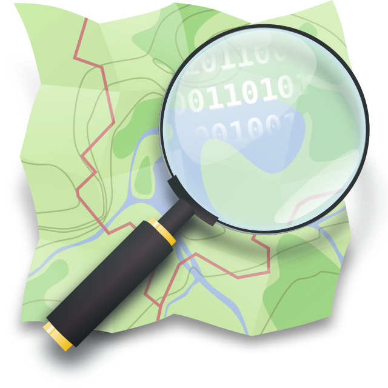
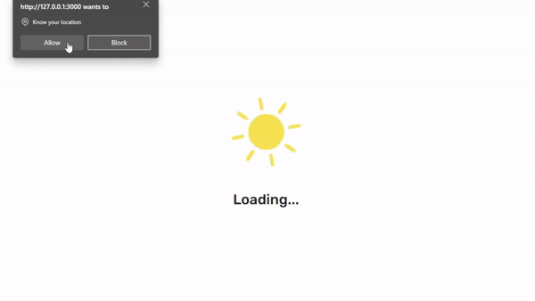
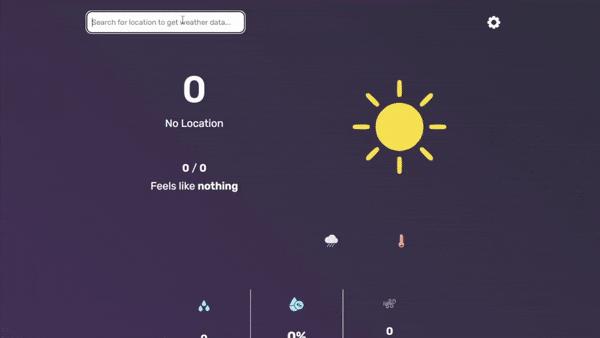

# Panahon

A [weather](http://panahon.surge.sh/)-based web application.

I used [Surge](https://surge.sh/) to deploy this project as one of the APIs I used is an **http** request, not _https_.

Grateful for the people who built these tools which made this project possible:

---

## Features

- [Weather retrieval with or without geolocation](#geolocation)

- [Search almost any location to retrieve weather](#search-location-for-weather)

- [Autocomplete and unit conversion](#autocomplete-and-unit-conversion)

- [Functioning weather radar](#weather-radar)

---

## Geolocation

It is handy to give control to the user whether they want to give their coordinates in exchange for acquiring weather data automatically (thanks Geolocation).

If not, Panahon would not crash but rather display an **alert** telling the user that he/she has declined the Geolocation request.

## Search Location for Weather

Whether you declined Geolocation or not, you can still request weather data through the search bar by typing in the **city/town** (country is optional) you want to look.

Not all locations (probably) are covered so be mindful with what you type. Search bar **accepts some languages** as input (i.e. Japanese, Chinese, German).

## Autocomplete and Unit Conversion

Some cities/towns around the world have the same name so autocomplete can come in useful for you to choose the right location to search for.

You can also switch between the metric and imperial system of units respectively. **Your preferences are saved through LocalStorage**.

## Weather Radar

While you cannot move forward in time to see patterns of movement, it is still cool to see it fully function.

You can switch between different layers of weather aspects (i.e. temperature).

**Fullscreen mode** is accomodated for all devices, small or large. (Though the bigger the device, the less resolution the map will have when fullscreened).

## License

© Copyright 2023. Keane Dalisay.

The content of this repository is licensed under [MIT](LICENSE).
